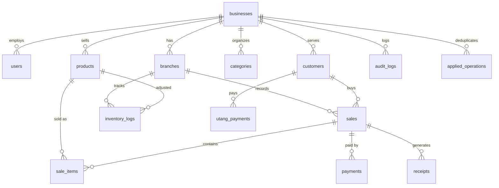

# Database Schema Reference — TD POS

> Source of truth: `supabase/migrations/20260508000000_initial_schema.sql`
> TypeScript types: `packages/db/src/schema.ts`

## Entity Relationship Diagram

## Core Tables

### products (Canonical Pieces Model)

| Column | Type | Description |
|---|---|---|
| `stock_pieces` | INTEGER NOT NULL | Current stock in smallest sellable unit |
| `pieces_per_pack` | INTEGER NOT NULL DEFAULT 1 | How many pieces make one pack |
| `price_per_piece` | NUMERIC | Selling price per piece |
| `price_per_pack` | NUMERIC | Selling price per pack |
| `cost_per_piece` | NUMERIC | Cost basis per piece |
| `is_tingi` | BOOLEAN | Whether per-piece selling is enabled |

**Display:** `divmod(stock_pieces, pieces_per_pack)` → "X packs + Y pieces"

### sale_items

| Column | Type | Description |
|---|---|---|
| `pieces_sold` | INTEGER NOT NULL | Always stored in pieces |
| `was_sold_as` | TEXT ('piece'/'pack') | What the customer saw on receipt |

### applied_operations (Race-Safe Dedup)

| Column | Type | Description |
|---|---|---|
| `business_id` | UUID | Tenant partition |
| `client_operation_id` | UUID | Client-generated idempotency key |
| `status` | TEXT | 'in_progress', 'completed', 'failed' |
| `result` | JSONB | Cached RPC result for replay |

### sync_queue (SQLite only — never on Supabase)

| Column | Type | Description |
|---|---|---|
| `client_operation_id` | TEXT UNIQUE | UUID for idempotent server application |
| `operation` | TEXT | INSERT, UPDATE, DELETE, or DELTA |
| `payload` | TEXT | JSON-serialized mutation data |
| `retry_count` | INTEGER | Exponential backoff tracking |
