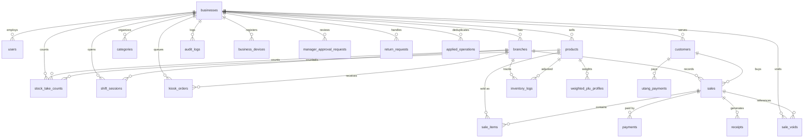

# Database Schema Reference — TD POS

> Source of truth: `supabase/migrations/*.sql`
> TypeScript types: `packages/db/src/schema.ts`
> Tier definitions: `packages/shared/src/constants/index.ts`

## Entity Relationship Diagram

## Core Tables

### businesses (Tenant + Entitlement Root)

| Column | Type | Description |
|---|---|---|
| `subscription_tier` | TEXT NOT NULL DEFAULT `tier_a_free` | Canonical A-E tier. Check-constrained to `tier_a_free`, `tier_b_pro`, `tier_c_plus`, `tier_d_premium`, `tier_e_enterprise`. |
| `module_state` | JSONB NOT NULL DEFAULT `{}` | Per-tenant module overrides. Shared tier defaults remain the baseline. |
| `entitlements_valid_until` | TIMESTAMPTZ | Last-known entitlement expiry for offline gating and fail-closed manager surfaces. |
| `max_products` | INTEGER | Tenant product limit override. `NULL` means use tier default / unlimited where applicable. |
| `max_branches` | INTEGER | Tenant branch limit override. |
| `max_devices` | INTEGER | Tenant device limit override. |
| `max_users` | INTEGER | Tenant user limit override. |

**Canonical tiers:** new rows use the five A-E values only. Legacy values from early scaffolds are normalized by `20260510000000_tier_normalization.sql`.

**Offline gating:** mobile stores the last successful entitlement snapshot in `auth-store`; cashier sales remain available offline, while manager/owner surfaces check the cached tier/module state.

### products (Canonical Pieces Model)

| Column | Type | Description |
|---|---|---|
| `stock_pieces` | INTEGER NOT NULL | Current stock in smallest sellable unit |
| `pieces_per_pack` | INTEGER NOT NULL DEFAULT 1 | How many pieces make one pack |
| `price_per_piece` | NUMERIC | Selling price per piece |
| `price_per_pack` | NUMERIC | Selling price per pack |
| `cost_per_piece` | NUMERIC | Cost basis per piece |
| `is_tingi` | BOOLEAN | Whether per-piece selling is enabled |

**Display:** `divmod(stock_pieces, pieces_per_pack)` → "X packs + Y pieces"

### customers (PII + Stable Transaction Reference)

| Column | Type | Description |
|---|---|---|
| `name` | TEXT NOT NULL | Customer display name; replaced with `Erased customer` after erasure. |
| `phone` | TEXT | Optional customer phone; cleared by the erasure RPC. |
| `barangay` | TEXT | Optional locality field; cleared by the erasure RPC. |
| `points_balance` | INTEGER | Loyalty scaffold balance; zeroed by the erasure RPC. |
| `total_utang` | NUMERIC | Utang scaffold balance; zeroed by the erasure RPC. |
| `pii_erased` | BOOLEAN | True once customer PII has been blanked. |
| `erased_at` | TIMESTAMPTZ | Timestamp of the erasure action. |
| `erased_by` | UUID | Owner or manager user who requested erasure. |
| `erasure_reason` | TEXT | Optional manager-entered reason; avoid storing sensitive details here. |

`20260512000000_customer_erasure.sql` adds `erase_customer_pii(uuid, text)`, a security-definer RPC for owner/manager roles. It blanks PII fields and writes a sanitized `audit_logs` entry, but keeps the customer row id so historical sales, payments, and future loyalty/utang references stay intact.

### sales (Immutable Receipt Ledger)

| Column | Type | Description |
|---|---|---|
| `created_at` | TIMESTAMPTZ / local INTEGER | Device wall-clock sale time. Receipt date namespaces derive from this value. |
| `device_timezone` | TEXT | IANA timezone reported by the cashier device when the sale was created. |
| `synced_server_time_at_last_handshake` | TIMESTAMPTZ | Last known server time before the sale, once handshake tracking lands. |
| `received_at` | TIMESTAMPTZ | Server insertion time for skew detection. Local SQLite does not store this field. |
| `synced_at` | TIMESTAMPTZ | Only mutable sales metadata field. |

Sales rows are immutable after creation; corrections use compensating rows. `20260512000002_sale_clock_metadata.sql` adds clock metadata and refreshes `create_sale_atomic(jsonb)` so the remote insert keeps local sale time and server receive time side by side.

### sale_items

| Column | Type | Description |
|---|---|---|
| `pieces_sold` | INTEGER NOT NULL | Always stored in pieces |
| `was_sold_as` | TEXT ('piece'/'pack') | What the customer saw on receipt |

### sale_voids

| Column | Type | Description |
|---|---|---|
| `business_id` | UUID | Tenant partition for RLS. Local SQLite omits this column and derives tenant context from the device. |
| `original_sale_id` | UUID / TEXT | Immutable sale being voided. Unique. |
| `compensating_sale_id` | UUID / TEXT | Fresh sale row with `status = 'voided'` and negative item/total values. Unique. |
| `reason` | TEXT | One of `wrong_item`, `customer_cancelled`, `duplicate_sale`, `cashier_error`, `other`. |
| `reason_note` | TEXT | Optional manager note. |
| `voided_by` | UUID / TEXT | Manager/owner user id when available. |

Voids never update the original sale. Mobile writes a separate receipt-numbered compensating sale, restores stock through a positive inventory delta, and stores the durable link in `sale_voids`. The server table from `20260512000006_sale_voids.sql` is RLS-scoped and immutable.

### applied_operations (Race-Safe Dedup)

| Column | Type | Description |
|---|---|---|
| `business_id` | UUID | Tenant partition |
| `client_operation_id` | UUID | Client-generated idempotency key |
| `status` | TEXT | 'in_progress', 'completed', 'failed' |
| `result` | JSONB | Cached RPC result for replay |

### sync_queue (SQLite only — never on Supabase)

| Column | Type | Description |
|---|---|---|
| `client_operation_id` | TEXT UNIQUE | UUID for idempotent server application |
| `operation` | TEXT | INSERT, UPDATE, DELETE, or DELTA |
| `payload` | TEXT | JSON-serialized mutation data |
| `retry_count` | INTEGER | Exponential backoff tracking |

### paid-tier surface scaffold tables

`20260511000000_tier_surface_scaffold.sql` creates tenant-scoped backend tables for the Tier B-E route shells. They are intentionally broad scaffolds: every table has `business_id`, RLS, and append/update semantics suitable for later production flows, but the full route behavior and test matrix remain 0.9 work.

| Table | Purpose |
|---|---|
| `business_devices` | Device/lane registry with install id, last seen, surface, cached entitlement snapshot, sanitized sync queue counts, receipt-sequence snapshot, and lost-device recovery metadata. |
| `shift_sessions` | Shift start, close, cash count, variance, and handoff notes. |
| `manager_approval_requests` | Pending/approved/declined manager decisions for voids, price overrides, and sensitive workflows. |
| `weighted_plu_profiles` | PLU code, unit, tare, and rounding profile for weighted products. |
| `kiosk_orders` | Self-service kiosk order queue awaiting staff confirmation before stock changes. |
| `return_requests` | Returns and warranty desk scaffold with original sale and compensating sale references. |
| `stock_take_counts` | Cycle-count snapshots for Stock Accuracy Score: counted pieces, system pieces before adjustment, delta, reason, and immutable timestamp. |

`business_devices` has a `business_devices_limit_guard` trigger that enforces `businesses.max_devices` for new install ids. Existing install ids can still heartbeat through `ON CONFLICT` updates. The `sync_snapshot` column carries counts only (`unsynced_rows`, `pending_rows`, `failed_rows`, `reviewable_rows`, timestamps) plus receipt sequence reservations (`branch_code`, `cashier_code`, `date`, `last_sequence`), never raw queue payloads. `20260513000000_device_recovery_metadata.sql` adds `lost_reported_at`, `lost_reported_by`, `replacement_requested_at`, and `recovery_note` so the web Devices flow can release a replacement slot without erasing the old device trail.

Mobile also has local-first counterparts for paid workflow scaffolds: `runLocalMigrations()` v2 creates SQLite `shift_sessions` so `mobile.shift_login` and `mobile.shift_handoff` can open, summarize, count, and close a cashier shift while offline; v3 creates SQLite `manager_approval_requests` so Tier C convenience counters and manager phones can queue and resolve local approval decisions. Those rows do not enter `sync_queue` yet; remote shift/approval sync is deferred until the shared sync envelope is extended beyond sales inserts and inventory deltas. Tier D Premium surfaces (`mobile.supermarket_counter`, `mobile.customer_display`, `mobile.backoffice_audit`, `mobile.weighted_plu`) do not add new local tables; they read from existing `products`, `sales`, `inventory_logs`, and `sync_queue` tables. The supermarket counter and weighted PLU surfaces write through the shared cart/checkout path; the back-office audit surface is gated to owner/manager roles. Tier E Enterprise surfaces add two new local tables: v4 creates `kiosk_orders` so `mobile.self_service_kiosk` can queue customer-built orders that require staff confirmation before stock is decremented; v5 creates `return_requests` so `mobile.returns_warranty` can record return reason codes and manager approval decisions against original sale references without mutating them (ADR-011). Local migration v6 adds the customer erasure marker columns to SQLite so local privacy cleanup and shared DB types stay aligned with the Supabase erasure scaffold. Local migration v8 creates `stock_take_counts`, which preserves counted pieces, system pieces before adjustment, and adjustment delta for the Stock Accuracy Score. Local migration v9 creates `sale_voids`, which links an immutable original sale to the local compensating sale receipt. `mobile.hq_rollup` reads from existing `branches`, `products`, `sales`, and `sync_queue` tables for cross-branch snapshots and is gated to owner/manager roles.

## Entitlement Guard Functions

The Supabase entitlement scaffold lives in `20260510000001_entitlement_guards.sql`.

| Function | Purpose |
|---|---|
| `normalize_subscription_tier(text)` | Converts legacy tier strings to the five canonical values. Unknown values fall back to `tier_a_free`. |
| `tier_includes_surface(text, text)` | Static A-E surface map mirroring `TIER_DEFINITIONS`. |
| `tier_includes_module(text, text)` | Static A-E module map mirroring `TIER_DEFINITIONS`. |
| `current_business_can_use_surface(text)` | Authenticated tenant surface check for web route/action guards. |
| `current_business_can_use_module(text)` | Authenticated tenant module check with tier unlock + per-business override semantics. |
| `current_business_entitlement_snapshot()` | Returns the signed-in tenant's canonical tier, module state, expiry, and limits. |
| `get_business_entitlements(uuid)` | Returns one tenant's canonical tier, module state, expiry, and limits for server-side checks. |
| `business_limit_value(uuid, text)` | Reads product, branch, device, or user limits for the signed-in tenant. |
| `assert_business_limit(uuid, text, integer)` | Raises a limit error when a mutating action would exceed a tenant limit. |

## Migration Inventory

| Migration | Purpose |
|---|---|
| `20260508000000_initial_schema.sql` | Initial tenant, inventory, sales, sync, receipt, audit, and entitlement columns. |
| `20260509000000_immutability_triggers.sql` | Server-side immutability for sales, sale items, and inventory logs. |
| `20260509000001_create_sale_atomic.sql` | Atomic remote sale creation RPC. |
| `20260510000000_tier_normalization.sql` | Canonical A-E tier normalization and check constraint. |
| `20260510000001_entitlement_guards.sql` | Server helper functions for entitlement and limit checks. |
| `20260511000000_tier_surface_scaffold.sql` | Tenant-scoped tables for paid-tier devices, shifts, approvals, PLUs, kiosks, and returns. |
| `20260511000001_pending_invites.sql` | Pending invite table and invite-consume RPC for phone OTP onboarding. |
| `20260511000002_business_limit_triggers.sql` | Defense-in-depth insert triggers for tier product, branch, user, and invite limits. |
| `20260512000000_customer_erasure.sql` | Customer PII erasure columns and owner/manager erasure RPC with sanitized audit logging. |
| `20260512000001_tenant_export_audit.sql` | Owner-only tenant export audit marker with `client_operation_id` dedupe. |
| `20260512000002_sale_clock_metadata.sql` | Device timezone, last-handshake placeholder, server `received_at`, and refreshed atomic sale RPC for skew detection. |
| `20260512000003_server_clock_handshake.sql` | Read-only authenticated RPC returning server time for mobile receipt-date skew guards. |
| `20260512000004_inventory_adjustment_reason.sql` | Refreshes `apply_inventory_delta` so stock takes log type `adjustment` while preserving manager-entered reason codes. |
| `20260512000005_stock_take_counts.sql` | Tenant-scoped immutable cycle-count snapshots for Stock Accuracy Score. |
| `20260512000006_sale_voids.sql` | Tenant-scoped immutable links between original sales and compensating void sale rows. |
