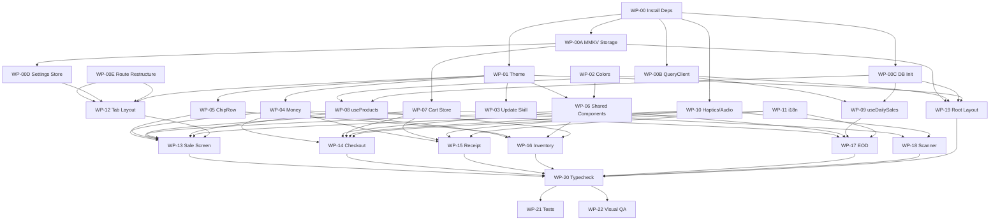

# Suki POS Integration — Multi-Agent Task Plan

> **Version:** 2.0 (fact-checked) · **Updated:** 2026-05-08T20:52 PHT · **Phase:** 1 (Tier A Lite)
> **Agents:** Claude (C), Gemini (G), Codex (X) · **Status Legend:** `[ ]` todo · `[/]` in progress · `[x]` done · `[!]` blocked

> [!CAUTION]
> **Fact-Check Errata (v2.0):** Three critical corrections from v1.0:
> 1. **`@shopify/flash-list` is v2.3.1** — `estimatedItemSize` is **DEPRECATED and removed**. v2 uses synchronous layout from New Architecture. Remove ALL size estimation props.
> 2. **`moti/skeleton` has Reanimated v4 compatibility issues** — community reports instability. Replaced with custom `Animated.View` + opacity pulse (zero-dep, Reanimated 4 native).
> 3. **`expo-image` placeholder** uses object syntax: `placeholder={{ blurhash: '...' }}`, NOT `placeholder={blurhash}`.

## How This Document Works

1. Each task has an **assigned agent** (C/G/X) and a **validator** (a different agent).
2. The assigned agent marks `[/]` when starting, `[x]` when done.
3. The validator runs the **acceptance criteria** and marks the `VALIDATED` sub-checkbox.
4. **Dependencies** are listed — do NOT start a task until its deps are `[x]`.
5. All agents MUST read `docs/skills/` before writing any code. See AGENTS.md §Skills.
6. All code MUST pass `bun run typecheck && bun run lint` before marking `[x]`.
7. Commit format: `feat(suki): description` for all Phase 1 work.

---

## Work Assignment Summary

| Agent | Role | Tasks | Est. Lines |
|---|---|---|---|
| **Codex (X)** | Infrastructure + data layer — deps, services, stores, hooks, i18n | WP-00, WP-00A–D, WP-07–11 | ~460 |
| **Claude (C)** | Design system + integration — theme, components, routes, provider, tests | WP-00E, WP-01–06, WP-19, WP-21 | ~550 |
| **Gemini (G)** | Screen implementation — all 5 Tier A screens + scanner + visual QA | WP-12–18, WP-22 | ~920 |

**Total work packages: 28** (WP-00 through WP-22 including 00A–00E)

---

## Phase 0: Dependencies & Setup

### WP-00: Install New Dependencies
- **Assign:** X · **Validate:** C · **Deps:** none
- [ ] Run: `npx expo install expo-image expo-haptics expo-audio expo-camera expo-linear-gradient react-native-svg @shopify/flash-list`
- [ ] ⚠️ Do NOT install `moti` — Reanimated v4 compatibility issues confirmed. Use custom skeleton instead.
- [ ] Verify `@shopify/flash-list` resolves to **v2.3.1+** (v2 requires New Architecture — SDK 55 ✅)
- [ ] Verify all resolve to SDK 55 compatible versions
- [ ] Run `bun run typecheck` — no new errors
- [ ] VALIDATED by C

---

## Existing Code Inventory (Read Before Coding)

> [!IMPORTANT]
> These files ALREADY EXIST. All agents must import from them — do NOT re-create types or constants.

| Package | File | What It Exports | Used By |
|---|---|---|---|
| `@tdpos/db` | `src/schema.ts` | `DbProduct`, `DbSale`, `DbSaleItem`, `DbSyncQueueRow`, `DbCategory`, `DbInventoryLog`, `DbCustomer` | All hooks, stores |
| `@tdpos/shared` | `src/types/index.ts` | `PaymentMethod`, `SoldAs`, `SyncOperation`, `ModuleName`, `UserRole`, `SaleStatus` | Cart store, checkout |
| `@tdpos/shared` | `src/constants/index.ts` | `DEFAULT_MODULE_STATE`, `TINGI_TEMPLATES`, `RECEIPT_SEQUENCE_PAD_LENGTH`, `SYNC_MAX_RETRIES`, `FREE_MAX_PRODUCTS` | Settings store, receipt gen |
| Mobile | `src/db/migrations/001_initial_schema.sql` | SQLite schema (products, sales, sale_items, sync_queue, receipt_sequence, categories) | DB initializer |

**Type usage rule:** Screens and hooks must use `DbProduct` (from `@tdpos/db`) for SQLite row types. Cart store uses its own `CartItem` interface (derived from `DbProduct` + qty/lineTotal).

| Empty directory (needs files) | Purpose |
|---|---|
| `apps/mobile/src/stores/` | Zustand stores (cart, settings) |
| `apps/mobile/src/services/` | MMKV adapter, QueryClient, Supabase client |
| `apps/mobile/src/hooks/` | Haptics, sounds, shared hooks |
| `apps/mobile/app/(tabs)/` | Currently empty — needs `(app)/(tabs)` restructure |

---

## Phase 0B: Foundational Infrastructure

> [!WARNING]
> **These are blocking prerequisites.** The existing repo has empty `stores/`, `services/`, and `(tabs)/` directories. These files must exist before any screen or hook can work.

### WP-00A: MMKV Storage Adapter
- **Assign:** X · **Validate:** C · **Deps:** WP-00
- **File:** `apps/mobile/src/services/storage.ts` (~15 lines)
- **Skill refs:** `zustand-mmkv-stores.md` (lines 16–27)
- [ ] Create `storage` MMKV instance: `new MMKV()`
- [ ] Create `mmkvStorage: StateStorage` adapter with `getItem`, `setItem`, `removeItem`
- [ ] This is the SINGLE shared instance — all stores import from here
- [ ] VALIDATED by C

### WP-00B: QueryClient Setup
- **Assign:** X · **Validate:** C · **Deps:** WP-00
- **File:** `apps/mobile/src/services/query-client.ts` (~20 lines)
- **Skill refs:** `tanstack-query-offline.md` (lines 22–37)
- [ ] Create `queryClient` with defaults: `staleTime: 5min`, `gcTime: 30min`, `retry: 2`, `refetchOnWindowFocus: false`
- [ ] ⚠️ Use `gcTime` NOT `cacheTime` (renamed in v5)
- [ ] VALIDATED by C

### WP-00C: Database Initializer
- **Assign:** X · **Validate:** C · **Deps:** WP-00
- **File:** `apps/mobile/src/db/init.ts` (~25 lines)
- **Skill refs:** `expo-sqlite-patterns.md` (lines 19–41)
- [ ] Export `initializeDatabase(db: SQLiteDatabase)` function
- [ ] Read and execute `001_initial_schema.sql` migration
- [ ] Set `PRAGMA journal_mode = WAL` and `PRAGMA foreign_keys = ON`
- [ ] This function is passed to `<SQLiteProvider onInit={initializeDatabase}>`
- [ ] VALIDATED by C

### WP-00D: Settings Store (with language field)
- **Assign:** X · **Validate:** C · **Deps:** WP-00A
- **File:** `apps/mobile/src/stores/settings-store.ts` (~40 lines)
- **Skill refs:** `zustand-mmkv-stores.md` (lines 78–104)
- [ ] Import `DEFAULT_MODULE_STATE` from `@tdpos/shared`
- [ ] Import `ModuleName` type from `@tdpos/shared`
- [ ] Interface: `modules: typeof DEFAULT_MODULE_STATE`, `language: 'en' | 'tl'`, `themeMode: 'system' | 'light' | 'dark'`
- [ ] Actions: `toggleModule(name: ModuleName)`, `setLanguage(lang)`, `setThemeMode(mode)`
- [ ] `partialize`: persist `modules`, `language`, `themeMode` only
- [ ] VALIDATED by C

### WP-00E: Route Restructure
- **Assign:** C · **Validate:** G · **Deps:** none
- **Current:** `apps/mobile/app/(tabs)/` (empty, flat)
- **Target:** `apps/mobile/app/(app)/(tabs)/` (per expo-router-patterns.md)
- [ ] Create directory `app/(app)/` with `_layout.tsx` using `Stack.Protected guard={!!user}`
- [ ] Move/create `app/(app)/(tabs)/` directory
- [ ] Create `app/(app)/(tabs)/_layout.tsx` placeholder (tab navigator shell)
- [ ] Ensure `app/(auth)/` routes remain separate (already exists)
- [ ] This matches the route structure in `expo-router-patterns.md` lines 22–39
- [ ] VALIDATED by G

---

## Phase 1A: Design System Foundation

### WP-01: Theme Constants
- **Assign:** C · **Validate:** G · **Deps:** WP-00
- **File:** `apps/mobile/src/constants/theme.ts` (~100 lines)
- **Skill refs:** `react-native-paper-theming.md`
- [ ] Create `lightTheme` extending `MD3LightTheme` with Suki POS teal palette:
  - `primary: '#0f766e'` (teal-700)
  - `tertiary: '#f59e0b'` (amber-500)
  - `secondary: '#22c55e'` (green-500)
  - `error: '#ef4444'` (red-500)
  - `background: '#fafaf9'` (ink-50)
- [ ] Create `darkTheme` extending `MD3DarkTheme` with inverted tokens:
  - `primary: '#5eead4'` (teal-300)
  - `background: '#1c1917'` (ink-900)
- [ ] Configure fonts via `configureFonts()` with Inter family
- [ ] Export `useAppTheme = () => useTheme<AppTheme>()`
- [ ] Acceptance: theme snapshot test — hex values match globals.css exactly
- [ ] VALIDATED by G

### WP-02: Extended Color Palette
- **Assign:** C · **Validate:** X · **Deps:** none
- **File:** `apps/mobile/src/constants/colors.ts` (~80 lines)
- [ ] Export full teal scale: `{ 50, 100, 200, 300, 400, 500, 600, 700, 800, 900 }`
- [ ] Export full amber scale: `{ 50, 100, 200, 300, 400, 500, 600, 700 }`
- [ ] Export full ink scale: `{ 50, 100, 200, 300, 400, 500, 600, 700, 800, 900 }`
- [ ] Export `categoryBg` map (9 entries from `shared.tsx tileBg`):
  - sachet→`#fef3c7`, noodle→`#fde68a`, biscuit→`#fed7aa`
  - drink→`#ccfbf1`, tobacco→`#e7e5e4`, load→`#dbeafe`
  - dairy→`#f0fdfa`, bakery→`#fef9c3`, rice→`#f5f5f4`
- [ ] VALIDATED by X

### WP-03: Update Theme Skill Doc
- **Assign:** C · **Validate:** G · **Deps:** WP-01
- **File:** `docs/skills/react-native-paper-theming.md`
- [ ] Replace green palette (`#1B5E20`) with teal palette (`#0f766e`)
- [ ] Add dark theme example
- [ ] Add `tertiary` token documentation (for CTA buttons)
- [ ] VALIDATED by G

---

## Phase 1B: Shared UI Components

### WP-04: Money Component
- **Assign:** C · **Validate:** X · **Deps:** WP-01
- **File:** `apps/mobile/src/components/ui/money.tsx` (~35 lines)
- [ ] Props: `value: number`, `size?: number`, `weight?: number`, `color?: string`
- [ ] Format: `₱` prefix + `toLocaleString('en-PH', { minimumFractionDigits: 2 })`
- [ ] Style: `fontVariant: ['tabular-nums']` for aligned columns
- [ ] Uses `useAppTheme()` for default color
- [ ] `accessibilityLabel={`${value} pesos`}`
- [ ] VALIDATED by X

### WP-05: Chip Row Component
- **Assign:** C · **Validate:** G · **Deps:** WP-01
- **File:** `apps/mobile/src/components/ui/chip-row.tsx` (~55 lines)
- [ ] Props: `items: { id: string; label: string }[]`, `active: string`, `onSelect: (id) => void`
- [ ] Horizontal `<ScrollView>` with Paper `<Chip>` components
- [ ] Active chip: `mode="flat"`, `selected={true}`, teal-700 bg
- [ ] Inactive chip: `mode="outlined"`
- [ ] `showsHorizontalScrollIndicator={false}`
- [ ] VALIDATED by G

### WP-06: Remaining Shared Components (5 files)
- **Assign:** C · **Validate:** G · **Deps:** WP-01, WP-02
- [ ] `product-glyph.tsx` (~70 lines):
  - Props: `product: Product`, `size?: number`
  - If `product.imageUri` exists → `<Image>` from `expo-image` with `cachePolicy="memory-disk"` + `placeholder={{ blurhash: product.blurhash }}` (object syntax!)
  - Add `transition={200}` for smooth crossfade on load
  - Else → `<View>` with `categoryBg[product.category]` bg + first letter of name
  - Rounded corners: `borderRadius: size * 0.22`
- [ ] `kpi-card.tsx` (~60 lines):
  - Props: `label: string`, `value: string`, `delta?: string`, `accent?: string`
  - Paper `<Card>` with structured vertical layout
  - Delta text color: green-500 for positive, red-500 for negative
- [ ] `eyebrow.tsx` (~20 lines):
  - `<Text>` with `textTransform: 'uppercase'`, `letterSpacing: 1.5`, `fontSize: 11`, ink-500
- [ ] `spark-bar.tsx` (~50 lines):
  - Props: `values: number[]`, `isLow?: boolean`, `width?: number`, `height?: number`
  - 8 `<Rect>` bars using `react-native-svg`
  - Normal: teal-500, opacity 0.55. Latest bar: opacity 1.0
  - If `isLow` and last bar: red-500 fill
- [ ] `skeleton-loader.tsx` (~45 lines) — **custom, NOT moti**:
  - Uses `Animated.View` from `react-native-reanimated` v4 with `useAnimatedStyle` + looping opacity
  - Props: `width: number`, `height: number`, `borderRadius?: number`
  - Group wrapper: `<SkeletonGroup show={boolean}>` that conditionally renders children vs skeletons
  - Color: `theme.colors.surfaceVariant` (adapts to dark mode)
- [ ] VALIDATED by G

---

## Phase 1C: Data Layer

### WP-07: Cart Store
- **Assign:** X · **Validate:** C · **Deps:** WP-00A
- **File:** `apps/mobile/src/stores/cart-store.ts` (~120 lines)
- **Skill refs:** `zustand-mmkv-stores.md`, `inventory-tingi-model.md`
- [ ] Import `PaymentMethod`, `SoldAs` from `@tdpos/shared`
- [ ] Import `mmkvStorage` from `@/services/storage` (WP-00A)
- [ ] Interface `CartItem`: `productId: string, name: string, qty: number, unitPrice: number, wasSoldAs: SoldAs, piecesPerPack: number, category: string, imageUri: string | null, lineTotal: number`
- [ ] Interface `CartState`: `items: CartItem[], paymentMethod: PaymentMethod | null, tendered: number, lastSaleResult: { receiptNumber: string; total: number; change: number } | null`
- [ ] Actions: `addItem, removeItem, updateQty, setPaymentMethod, setTendered, setLastSaleResult, clear`
- [ ] Use `create<CartState>()(persist(...))` pattern with `mmkvStorage`
- [ ] `partialize` — persist only `items` (NOT ephemeral payment state)
- [ ] `addItem` logic: if product already in cart, increment qty; else push new item
- [ ] `lineTotal` computed as `qty * unitPrice`
- [ ] Acceptance: unit test — add pack item, verify `lineTotal` correct
- [ ] VALIDATED by C

### WP-08: useProducts Hook
- **Assign:** X · **Validate:** C · **Deps:** WP-00B, WP-00C
- **File:** `apps/mobile/src/features/products/hooks/use-products.ts` (~40 lines)
- **Skill refs:** `tanstack-query-offline.md`, `expo-sqlite-patterns.md`
- [ ] Import `DbProduct` from `@tdpos/db` — use as row type
- [ ] `useProducts(category?: string)` using `useQuery`
- [ ] `queryKey: ['products', category ?? 'all']`
- [ ] `queryFn`: `db.getAllAsync<DbProduct>()` with optional category WHERE clause
- [ ] `staleTime: 5 * 60 * 1000` (5 min)
- [ ] `gcTime: 30 * 60 * 1000` (30 min) — NOT `cacheTime`
- [ ] NO `onSuccess` callback (removed in React Query v5)
- [ ] VALIDATED by C

### WP-09: useDailySales Hook
- **Assign:** X · **Validate:** C · **Deps:** WP-00
- **File:** `apps/mobile/src/features/reports/hooks/use-daily-sales.ts` (~45 lines)
- **Skill refs:** `tanstack-query-offline.md`, `expo-sqlite-patterns.md`
- [ ] `useDailySales(dateStr: string)` using `useQuery`
- [ ] SQL: aggregate sales by hour from `sales` table
- [ ] Also query payment method breakdown (cash/gcash/utang totals)
- [ ] `staleTime: 60 * 1000` (1 min — live data)
- [ ] Returns `{ hourlyData, paymentMix, grossTotal, itemCount, saleCount }`
- [ ] VALIDATED by C

### WP-10: Haptics & Audio Hooks
- **Assign:** X · **Validate:** G · **Deps:** WP-00
- [ ] `apps/mobile/src/hooks/use-haptics.ts` (~30 lines):
  - Export `useHaptics()` returning `{ tapLight, tapMedium, selection, success, error }`
  - Each wraps the corresponding `expo-haptics` API call
- [ ] `apps/mobile/src/hooks/use-pos-sounds.ts` (~45 lines):
  - 4 sounds: `scan-beep`, `cart-add`, `sale-success`, `error`
  - Pre-load via `useAudioPlayer(require(...))` at mount
  - Each play function calls `seekTo(0)` then `play()` (expo-audio requirement)
- [ ] `apps/mobile/assets/sounds/` — 4 MP3 files (source royalty-free)
- [ ] VALIDATED by G

### WP-11: Translations
- **Assign:** X · **Validate:** G · **Deps:** none
- **File:** `apps/mobile/src/i18n/translations.ts` (~60 lines)
- [ ] Export `translations` object with `en` and `tl` keys
- [ ] 23 translation keys covering all 5 screens (see implementation plan)
- [ ] Export `useT()` hook that reads language from `useSettingsStore().language`
- [ ] `useT()` returns `(key: string) => string`
- [ ] Settings store updated with `language: 'en' | 'tl'` field
- [ ] VALIDATED by G

---

## Phase 1D: Screen Implementation

### WP-12: Tab Navigator Layout
- **Assign:** G · **Validate:** C · **Deps:** WP-01, WP-02, WP-00D, WP-00E
- **File:** `apps/mobile/app/(app)/(tabs)/_layout.tsx` (~60 lines)
- **Skill refs:** `expo-router-patterns.md`
- [ ] Requires WP-00E route restructure complete first
- [ ] Import `useSettingsStore` (WP-00D) for module toggles
- [ ] 4 tabs: Sale (`cart-outline`), Stock (`package-variant`), Utang (`credit-card-outline`), Report (`trending-up`)
- [ ] `tabBarActiveTintColor: '#0f766e'` (teal-700)
- [ ] Utang tab: conditionally rendered based on `useSettingsStore().modules.utang`
- [ ] When utang disabled, show only 3 tabs (Sale, Stock, Report)
- [ ] Use `useShallow` for multi-value settings select (Zustand 5 requirement)
- [ ] VALIDATED by C

### WP-13: Sale Screen
- **Assign:** G · **Validate:** C · **Deps:** WP-04, WP-05, WP-06, WP-07, WP-08, WP-10, WP-12
- **File:** `apps/mobile/app/(app)/(tabs)/index.tsx` (~180 lines)
- [ ] Paper `<Appbar.Header>` with teal-700 bg, store name from `useAuthStore().branchName`
- [ ] `<ChipRow>` with categories from `useProducts()` data
- [ ] `<FlashList numColumns={4}>` for product grid — ⚠️ NO `estimatedItemSize` (removed in v2)
- [ ] Each cell: `<Pressable>` → `<ProductGlyph>` + name + `<Money>` price badge
- [ ] `onPress` → `cartStore.addItem(product)` + `haptics.tapLight()` + `sounds.playCartAdd()`
- [ ] Cart bar (bottom): teal-800 bg, item count + piece count + `<Money>` total
- [ ] Piece count: `cart.reduce((s, i) => s + i.qty * (i.wasSoldAs === 'pack' ? i.piecesPerPack : 1), 0)`
- [ ] "Charge →" amber button → `router.push('/checkout')` + `haptics.tapMedium()`
- [ ] Loading state: `<SkeletonGroup show={isPending}>` with 4×2 grid (custom component, NOT moti)
- [ ] `accessibilityLabel` on every product tile: `"${name}, ${price} pesos, tap to add"`
- [ ] VALIDATED by C

### WP-14: Checkout Screen
- **Assign:** G · **Validate:** C · **Deps:** WP-04, WP-06, WP-07, WP-10, WP-11
- **File:** `apps/mobile/app/(app)/checkout.tsx` (~200 lines)
- **Skill refs:** `receipt-numbering.md`, `sync-engine.md`, `expo-sqlite-patterns.md`
- [ ] 3 payment method cards: Cash (green-500), GCash (#0066cc), Utang (amber-500)
- [ ] ⚠️ **UTANG IS NOT A PAYMENT METHOD** — it's a boolean flag `is_utang: true` on the `sales` table. When utang is selected, set `payment_method='cash'` AND `is_utang=1`. This matches `PaymentMethod` type in `@tdpos/shared` which has no `'utang'` variant.
- [ ] Utang card: HIDDEN when `modules.utang === false` (architecture rule #8)
- [ ] Selected card: `border: 2px teal-700`, `bg: teal-50`
- [ ] Payment select → `haptics.tapMedium()`
- [ ] Denomination grid: `[20, 50, 100, 200, 250, 300, 500, 1000]`, 4 columns
- [ ] Denomination grid: HIDDEN when Utang is selected (no cash tendered for credit)
- [ ] Each denom tap → `haptics.selection()` + `cartStore.setTendered(amount)`
- [ ] Summary: subtotal, tendered, change due (green-600)
- [ ] `accessibilityLiveRegion="assertive"` on change due text
- [ ] Cancel button (✕) → `router.back()`
- [ ] Confirm button → full sale write transaction:
  1. Generate `client_operation_id` via `crypto.randomUUID()`
  2. Generate receipt number via `receipt-numbering.md` pattern
  3. `db.withTransactionAsync()`:
     - INSERT into `sales` with `payment_method`, `is_utang`, `total_amount` (immutable — rule #6)
     - INSERT into `sale_items` (pieces_sold in canonical pieces — rule #2)
     - UPDATE `products` SET `stock_pieces -= piecesSold` (delta — rule #3)
     - INSERT into `sync_queue` with `client_operation_id` (rule #4)
     - UPDATE `receipt_sequence` counter
     - If `is_utang`: UPDATE `customers` SET `total_utang += total_amount`
  4. `haptics.success()` + `sounds.playSuccess()`
  5. `cartStore.setLastSaleResult({ receiptNumber, total, change })`
  6. `router.push('/receipt')`
- [ ] VALIDATED by C

### WP-15: Receipt Screen
- **Assign:** G · **Validate:** X · **Deps:** WP-04, WP-07, WP-10, WP-11
- **File:** `apps/mobile/app/(app)/receipt.tsx` (~180 lines)
- [ ] Success header: gradient teal-900→teal-800, centered
- [ ] Green checkmark: 70dp circle, green-500, `Entering.ZoomIn.springify()` animation
- [ ] Sale amount: `<Money>` white, size 35, from `cartStore.lastSaleResult`
- [ ] Change pill: green bg, amber-300 change text
- [ ] Thermal receipt card:
  - Torn-edge SVG (zigzag `<Path>`) top + bottom
  - Paper-colored bg (`#fffdf8`), monospace font
  - Store name, address, VAT REG TIN (from auth-store)
  - Receipt number in `BRANCH-CASHIER-DATE-SEQUENCE` format
  - Line items with tabular-nums alignment
  - TOTAL bold
  - Footer: `translations.receipt.footer`
  - "Powered by Suki POS"
- [ ] 3 action buttons: SMS, Print, New Sale
- [ ] Print → `@haroldtran/react-native-thermal-printer` (per `thermal-printer-integration.md`)
- [ ] New Sale → `cartStore.clear()` + `router.replace('/')` + `haptics.tapMedium()`
- [ ] VALIDATED by X

### WP-16: Inventory Screen
- **Assign:** G · **Validate:** X · **Deps:** WP-04, WP-05, WP-06, WP-08
- **File:** `apps/mobile/app/(app)/(tabs)/inventory.tsx` (~150 lines)
- **Skill refs:** `inventory-tingi-model.md`
- [ ] App bar with 3 KPI cards (inside expanded header):
  - Stock value (₱ total), Items low (count), Out of stock (count)
- [ ] `<ChipRow>` with category counts: "All · 156", "⚠ Low · 4", etc.
- [ ] `<FlashList>` for inventory list — ⚠️ NO `estimatedItemSize` (removed in v2)
- [ ] Each row: `<ProductGlyph>` + name + stock display + `<SparkBar>` + restock button
- [ ] Stock display: `divmod(stock_pieces, pieces_per_pack)` → "X packs + Y pcs"
- [ ] LOW badge: `<Chip>` red-600 bg, white text, when `stock_pieces <= reorder_point_pieces`
- [ ] Low-stock rows: `backgroundColor: 'rgba(254, 226, 226, 0.35)'`
- [ ] Loading state: `<SkeletonGroup>` with list row shapes (custom component, NOT moti)
- [ ] `accessibilityLabel` on LOW badge: `"Low stock warning"`
- [ ] VALIDATED by X

### WP-17: End of Day Screen
- **Assign:** G · **Validate:** X · **Deps:** WP-04, WP-06, WP-09, WP-11
- **File:** `apps/mobile/app/(app)/(tabs)/reports.tsx` (~170 lines)
- [ ] Dark app bar (`bg: #292524`), "Today" / "Ngayon", `<StatusChip label="Live">`
- [ ] Gross sales `<Money>` white, size 44
- [ ] Delta badge: "+18% vs yesterday", green-500, `Entering.FadeInUp`
- [ ] Stats: "47 items · 26 sales" (white, opacity 0.7)
- [ ] Hourly chart card:
  - 12 `react-native-svg` `<Rect>` bars (6AM–10PM)
  - Normal: gradient teal-500→teal-700
  - Peak hour: gradient amber-500→amber-600 + "peak" label above
  - X-axis labels: "6a 10a 2p 6p 10p"
- [ ] Payment mix card:
  - Stacked `<View>` bar (flex widths: cash%, gcash%, utang%)
  - 3 rows: color dot + icon + label + percentage + `<Money>` amount
- [ ] `accessibilityLiveRegion="polite"` on gross sales
- [ ] VALIDATED by X

### WP-18: Barcode Scanner Modal
- **Assign:** G · **Validate:** X · **Deps:** WP-07, WP-10
- **File:** `apps/mobile/app/(app)/scanner.tsx` (~80 lines)
- [ ] `useCameraPermissions()` + permission request UI
- [ ] `<CameraView>` with `barcodeScannerSettings={{ barcodeTypes: ['ean13', 'upc_a', 'code128'] }}`
- [ ] `onBarcodeScanned` → throttle 2000ms → lookup product by SKU → `cartStore.addItem()`
- [ ] `haptics.tapLight()` + `sounds.playBeep()` on successful scan
- [ ] Graceful fallback if camera permission denied
- [ ] VALIDATED by X

---

## Phase 1E: Integration & Provider Wiring

### WP-19: Root Layout Provider Stack
- **Assign:** C · **Validate:** G · **Deps:** WP-00A, WP-00B, WP-00C, WP-01
- **File:** `apps/mobile/app/_layout.tsx` (modify existing)
- [ ] Import `storage` from `@/services/storage` (WP-00A) — just to ensure MMKV inits first
- [ ] Import `queryClient` from `@/services/query-client` (WP-00B)
- [ ] Import `initializeDatabase` from `@/db/init` (WP-00C)
- [ ] Import `lightTheme`, `darkTheme` from `@/constants/theme` (WP-01)
- [ ] Provider order (outermost → innermost):
  1. `<GestureHandlerRootView>`
  2. `<SQLiteProvider databaseName="tdpos.db" onInit={initializeDatabase}>`
  3. `<QueryClientProvider client={queryClient}>`
  4. `<PaperProvider theme={paperTheme}>`
  5. `<Stack>` with `Stack.Protected` guards (per expo-router-patterns.md)
- [ ] `paperTheme` switches on `useColorScheme()` + `useSettingsStore().themeMode`
- [ ] VALIDATED by G

---

## Phase 2: Verification

### WP-20: Type Check & Lint
- **Assign:** X · **Validate:** C · **Deps:** all WP-01 through WP-19
- [ ] `bun run typecheck` — zero errors
- [ ] `bun run lint` — zero errors
- [ ] VALIDATED by C

### WP-21: Required Spec §14 Tests
- **Assign:** C · **Validate:** X · **Deps:** WP-20
- [ ] Test #1: Tingi math — sell 7 from 12-sachet pack → `stock_pieces` = 5
- [ ] Test #2: Delta concurrency — two offline branches sell 1 of 2 → stock = 0
- [ ] Test #3: Negative stock guard — sale exceeding stock → `pending_sync_review`
- [ ] Test #4: Idempotency — same `client_operation_id` twice → one decrement only
- [ ] Test #5: Receipt collision — two offline devices, 5 txns each → all 10 unique
- [ ] Test #6: TOCTOU race — 100 concurrent calls, same op_id → exactly one decrement
- [ ] VALIDATED by X

### WP-22: Visual QA
- **Assign:** G · **Validate:** C · **Deps:** WP-20
- [ ] Side-by-side: `UI/` design canvas in browser ↔ Expo dev build on device
- [ ] All 5 screens match design spec colors, spacing, typography
- [ ] Touch targets: minimum 48dp on all interactive elements
- [ ] Dark mode: toggle system setting → all screens adapt correctly
- [ ] Accessibility: VoiceOver (iOS) / TalkBack (Android) full sale flow
- [ ] VALIDATED by C

---

## Dependency Graph

---

## Quick Reference: Skill Docs Required Per Task

| Task | Skills to Read First |
|---|---|
| WP-00A | `zustand-mmkv-stores.md` (lines 16–27) |
| WP-00B | `tanstack-query-offline.md` (lines 22–37) |
| WP-00C | `expo-sqlite-patterns.md` (lines 19–41) |
| WP-00D | `zustand-mmkv-stores.md` (lines 78–104) |
| WP-00E | `expo-router-patterns.md` (lines 22–39) |
| WP-01, WP-03 | `react-native-paper-theming.md` |
| WP-07 | `zustand-mmkv-stores.md`, `inventory-tingi-model.md` |
| WP-08, WP-09 | `tanstack-query-offline.md`, `expo-sqlite-patterns.md` |
| WP-12 | `expo-router-patterns.md` |
| WP-14 | `receipt-numbering.md`, `sync-engine.md`, `expo-sqlite-patterns.md` |
| WP-15 | `thermal-printer-integration.md` |
| WP-16 | `inventory-tingi-model.md` |
| WP-19 | `expo-router-patterns.md`, `expo-sqlite-patterns.md` |

## Anti-Hallucination Reminders

| ❌ DO NOT | ✅ DO | Why |
|---|---|---|
| `SQLite.openDatabase()` | `SQLiteProvider` + `useSQLiteContext()` | Legacy API removed in SDK 55 |
| `useStore(s => ({ a: s.a, b: s.b }))` | `useStore(useShallow(s => ({ a: s.a, b: s.b })))` | Zustand 5 infinite re-render bug |
| `useQuery({ onSuccess })` | Removed in v5 — use `useEffect` | Breaking change in React Query v5 |
| `cacheTime` | `gcTime` (renamed in v5) | Breaking change in React Query v5 |
| `DefaultTheme` (Paper v4) | `MD3LightTheme` (Paper v5) | MD2 → MD3 migration |
| `expo-background-fetch` | `expo-background-task` | Package removed from Expo |
| `colors.accent` | `colors.secondary` (MD3) | MD3 token rename |
| Absolute stock values in sync | Delta values only (`-1`, not `99`) | Prevents concurrent overwrite |
| "BIR-compliant" | "BIR-ready" | Legal — not accredited yet |
| `FlashList estimatedItemSize` | Remove prop entirely | Deprecated in FlashList v2 |
| `moti` / `moti/skeleton` | Custom Reanimated v4 skeleton | Moti has Reanimated v4 compat issues |
| `placeholder={blurhash}` (expo-image) | `placeholder={{ blurhash: '...' }}` | Object syntax required |
| `expo-av` for sound | `expo-audio` (new API) | expo-av deprecated for audio |
| `Haptics.impact(...)` without import | `import * as Haptics from 'expo-haptics'` | Named import required |
| `expo-barcode-scanner` | `expo-camera` `CameraView` | expo-barcode-scanner deprecated |

---

## Verified Package Versions (Fact-Checked May 8, 2026)

| Package | Verified Version | Notes |
|---|---|---|
| `@shopify/flash-list` | **2.3.1** | v2 = New Arch only, no `estimatedItemSize` |
| `expo-image` | **55.x** (SDK-matched) | `placeholder={{ blurhash }}` object syntax |
| `expo-haptics` | **55.x** | `impactAsync`, `notificationAsync`, `selectionAsync` |
| `expo-audio` | **55.x** | Replaces `expo-av`. `useAudioPlayer` + `seekTo(0)` |
| `expo-camera` | **55.x** | `CameraView` + `useCameraPermissions()` |
| `expo-linear-gradient` | **55.x** | For skeleton shimmer gradient |
| `react-native-svg` | **15.x** | Charts, spark bars |
| `react-native-reanimated` | **4.x** | New Arch only. `Entering`, `Exiting`, CSS animations |
| `react-native-gesture-handler` | **3.x** | Hook API (`usePanGesture`), `Swipeable` |

---

## SQLite Table Reference (from `001_initial_schema.sql`)

Agents must use these EXACT column names — do NOT invent columns:

| Table | Key Columns | Notes |
|---|---|---|
| `products` | `id, name, stock_pieces, pieces_per_pack, price_per_piece, price_per_pack, cost_per_piece, reorder_point_pieces, is_tingi, is_active, category_id, sku` | `stock_pieces` is INTEGER, never fractional |
| `sales` | `id, branch_id, total_amount, payment_method, receipt_number, is_utang, synced_at` | Immutable — no UPDATE (except synced_at) |
| `sale_items` | `id, sale_id, product_id, pieces_sold, was_sold_as, unit_price, subtotal` | `pieces_sold` always canonical pieces |
| `sync_queue` | `id, client_operation_id, table_name, record_id, operation, payload, retry_count` | Local only — never on Supabase |
| `receipt_sequence` | `branch_code, cashier_code, date, last_sequence` | Composite PK, monotonic counter |
| `categories` | `id, business_id, name, color` | For chip filtering + tile bg |
| `inventory_logs` | `id, product_id, pieces_delta, type, reason` | Append-only audit trail |
